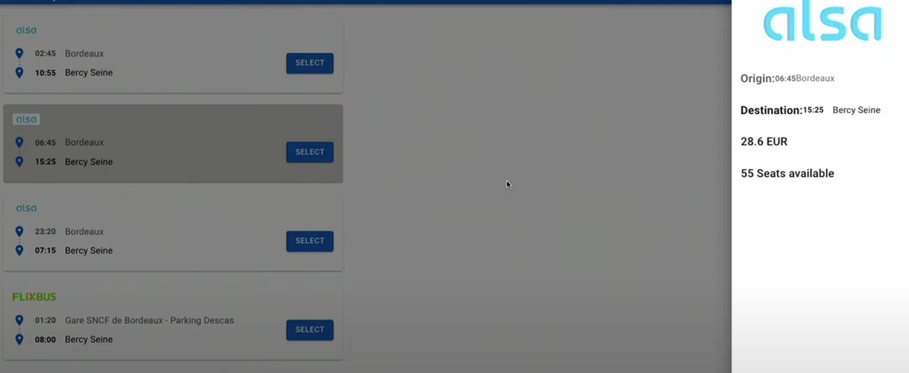

# 05 sujet Challenge Trips

Faites une gestion de trips à l'aide d'un store en utilisant useReducer. Vous être libre de gérer ce projet comme vous l'entendez.

Chaque trip est cliquable et on donnera le détails d'un trip sur le côté.

Utilisez Styled Component si possible soit en CDN soit avec CRA

Voici le Wireframe d'exemple

