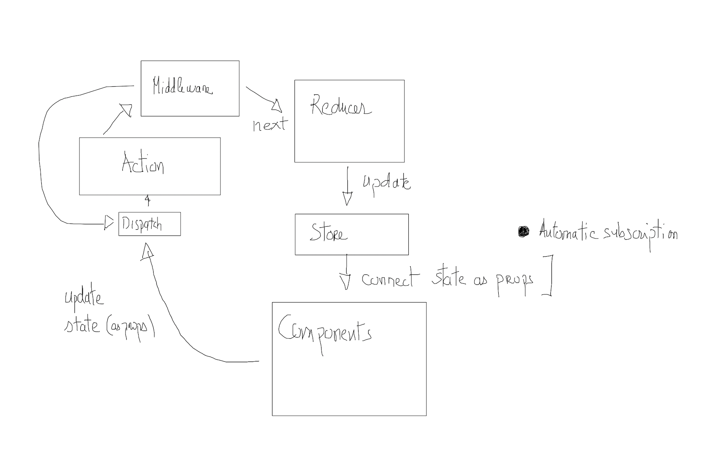

# Redux avancé

## Combine reducer

Dans une application on découpe souvent l'algorithmique en plusieurs stores. Redux fournit une méthode **CombineReducer** qui permet de "combiner plusieurs reducers".

Supposons que l'on ait deux reducers a et b, alors vous pouvez définir dans votre dossier reducers un fichier index.js et combiner les reducers comme suit :

```js
import { combineReducers } from 'redux';

import a from './a';
import b from './b';

export default combineReducers({
    aRdecuer : a,
    bReducer : b
});

```

Si vous utilisez create-react-app, vous importerez le fichier **index.js** dans votre fichier de bootstrap, fichier index.js à la racine de votre application. Le "combine reducer" se récupère comme un reducer classique :

```js
import { createStore } from 'redux';
import { Provider } from 'react-redux';
// Combine Reducer
import reducer from './reducers/index';

const store = createStore(reducer);

ReactDOM.render(
<Provider store={store}>
    <App />
</Provider>
, document.getElementById('root'));
```

## Comment utilisez le store d'un combine reducer

Dans la lecture des props dans un composant, il faudra faire attention à sélecionner le bon store. Dans l'exemple que nous avons donné dans le cours pour lire le store a ou b vous devrez écrire :

```js

const { a, b } = useSelector(state => {

  return {
    a : state.aRdeucer,
    b : state.bReducer
  }
})
```

## Middleware

Les middlewares se trouvent, ensemble de fonction(s), entre l'envoie (dispatch) et les réduceurs (reducers). Nous pouvons donc techniquement modifier les actions distribuées avant qu'ils arrivent aux réduceurs, ou exécuter une fonctionnalités lors de ce processus.



### Middleware signature

Voici la signature d'un middleware :

```js
const customMiddleware = store => next => action {
    const state = store.getState(); 
    const returnAction = next(action);
    
    return returnAction ;
}
```
Cette écriture de fonction anonyme est pratique pour éviter les problèmes de this, mais si on souhaite l'écrire avec le mot réservé function de JS :

```js
function customMiddleware(store) {
  const next = store.dispatch;

  return function dispatch(action) {
    const returnAction = next(action);
    
    return returnAction;
  }
}
```

Cette fonction fonction reçoit le store elle retourne une fonction qui reçoit les next. Ici (dans la partie next) nous pouvons donc décider d'envoyer d'autre(s) action(s) à un reduceur (ou un autre middleware). Cette dernière fonction retournera également l'action en cours de dispatching.

### remarque

Une telle fonction est une fonction renvoyant une autre fonction. Voici un exemple en JS

```js
const myFunc = a => b => a + b ;

// Retournera 20
myFunc(10)(10)
```
## Exemple logs avec un middleware

Refactorez les logs en créant un middleware : middlewareLog. Vous pouvez créer une branch avec Git refactoring (facultatif). Lorsqu'on ajoute ou supprime un dragon et uniquement pour ces actions, notifiez le dans les logs à l'aide de votre middleware.

## Middleware thunk

Les actions sont dispatchées de manière synchrone dans le reducer. Pour pouvoir gérer des actions asynchrones on doit installer le module thunk qui est un middleware. Il permettra de gérer l'asynchrone des actions dans le reducer.

Imaginons la problématique suivante dans le fichier actions-types.js :

```js
const COUNTER = 'COUNTER';

// Cette action est synchrone
export const  set_counter = payload => {
  return {
    type: COUNTER, payload
  };
}

// Cette action est asynchrone (...)
export const startCounter = () => {

   return dispatch => {
        setInterval(() => {
        dispatch(set_counter(1)); // Ici on dispatch une action asynchrone => Redux ne sait pas le faire nativement (...)
        }, 1000);
  };
}
```

## Exercice Chrono simple

Mettez en place un chrono simple, créez un nouveau reducer, dans votre application Counter. N'utilisez pas pour l'instant le module thunk, nous allons essayer de mettre en évidence la problématique des actions asynchrones dans Redux. Théoriquement votre chrono ne marchera pas (...).

Dans le header de l'application:

```txt
  [14] <-- secondes qui défilent
```
Romain Bousquié

## Exercice Dragons

Créez un CRUD pour géré des Dragons (nom & age).

Comptez dans le nombre de Dragon à l'aide d'un middleware.

Placez un compteur asynchrone sur la page.

Soit vous élaborez cet exercice avec Redux classiquement, soit vous utilisez les techniques toolkit redux que nous avons abordé.

Installez :

```bash
npm install redux-thunk
```

Puis, dans React dans le fichier **index.js** vous l'installez comme suit, une fois cette configuration réalisé vous pourrez gérer un dispatch asynchrone comme fetchAsync ci-dessus :

```js
import React from 'react';
import ReactDOM from 'react-dom';
import './index.css';
import App from './App';

import * as serviceWorker from './serviceWorker';

// Redux avec le middleware 
import { createStore, applyMiddleware } from 'redux';

// thunk permet la gestion de l'asynchrone dans Redux
import thunk from 'redux-thunk';

import { Provider } from 'react-redux';
import reducer from './reducers/index';

const store = createStore(reducer, applyMiddleware(thunk) );
// console.log(store.getState())

// On passe le store à l'application composant racine
ReactDOM.render(
<Provider store={store}>
    <App />
</Provider>
, document.getElementById('root'));

// If you want your app to work offline and load faster, you can change
// unregister() to register() below. Note this comes with some pitfalls.
// Learn more about service workers: https://bit.ly/CRA-PWA
serviceWorker.unregister();
```
